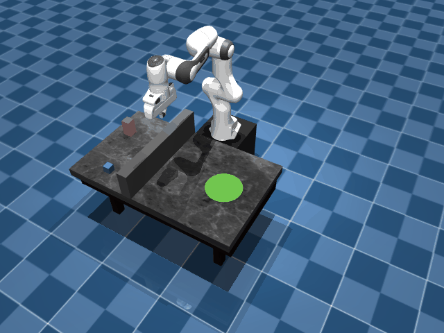

# panda-mujoco

> A MuJoCo simulation platform for the Franka Emika Panda arm, integrating **Pinocchio inverse kinematics** and **OMPL motion planning** for complete pick-and-place and obstacle avoidance.

---

## Features

| Capability | Location | Description |
|---|---|---|
| Robot simulation | `panda_mujoco/env.py` | MuJoCo wrapper with real-time viewer, state sync, and thread-safe ctrl |
| Inverse kinematics | `panda_mujoco/ik_solver.py` | Pinocchio-based IK supporting arbitrary target frames, SE3 poses, warm-start |
| Motion planning | `panda_mujoco/ompl_planner.py` | OMPL sampling planner with velocity/acceleration limits and collision-pair filtering |
| Pick & place | `panda_mujoco/tasks/pick_place.py` | Finite state machine (pregrab → grab → lift → place → reset) with force-based gripper control |
| Dynamic avoidance | `panda_mujoco/tasks/avoidance.py` | Real-time replanning around obstacles set via mocap bodies |
| Robot API | `panda_mujoco/robot.py` | High-level helpers: `ee_pose()` / `ik()` / `move_to()` / `open/close_gripper()` |

